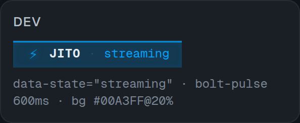
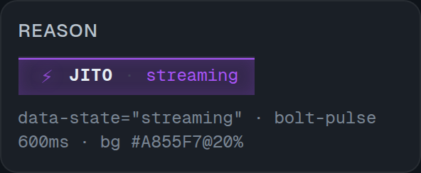
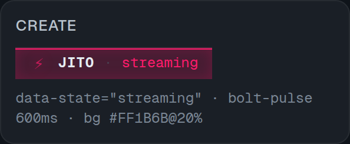
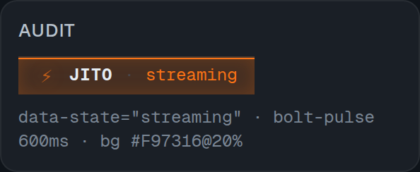
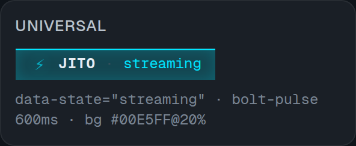

<p align="center">
  
</p>

<h3 align="center">Multi-mode AI for your editor.</h3>

<p align="center">
  <strong>5 first-class modes, one extension.</strong><br/>
  Built for solo devs who ship.
</p>

<p align="center">
  <a href="https://github.com/open-uppu/jito-ide/blob/main/LICENSE"></a>
  <a href="https://github.com/open-uppu/jito-ide"></a>
  
  
</p>

## Why jito-ide?

- Multi-mode by default. `dev`, `reason`, `create`, `audit`, and `universal` are first-class chat modes with distinct system prompts, icons, color stripes, and status-bar tints.

- Powered by [jito](https://github.com/open-uppu/jito). The same Go CLI that drives jito's standalone UX runs as a subprocess inside VS Code. Free, local-first, no telemetry.

- Pairs with Minimax-M3. Same model as Cursor, without the $20/mo tax.

## The 5 modes

| Mode | Color | Purpose |
|---|---:|---|
| `dev` | `#00A3FF` | Coding, refactor, debug, implementation |
| `reason` | `#A855F7` | Architecture, planning, tradeoffs, decisions |
| `create` | `#FF1B6B` | Docs, content, product copy, generation |
| `audit` | `#F97316` | Review, security, correctness, risk |
| `universal` | `#00E5FF` | General work, mixed tasks, fallback |



**Dev** — Build, debug, refactor, and ship code.



**Reason** — Think through architecture, plans, and hard tradeoffs.



**Create** — Draft docs, copy, specs, and structured content.



**Audit** — Review code, find risks, and tighten correctness.



**Universal** — Handle broad, mixed, or unclear tasks.

Full per-mode details live in [docs/modes.md](docs/modes.md).

## Architecture

```
┌──────────────────────────────────────────────────────┐
│                jito-ide (VS Code)                     │
│  ┌──────────┐  ┌──────────┐  ┌──────────┐  ┌───────┐ │
│  │  Chat    │  │  Mode    │  │  Inline  │  │ Files │ │
│  │  panel   │  │ switcher │  │  edit    │  │  ctx  │ │
│  └─────┬────┘  └─────┬────┘  └─────┬────┘  └───┬───┘ │
│        └──────────────┴──────┬───────┴────────────┘   │
│                              │                        │
│                    ┌─────────▼──────────┐             │
│                    │  TS Extension Host │             │
│                    │  Node.js + ws      │             │
│                    └─────────┬──────────┘             │
│                              │ subprocess             │
│                    ┌─────────▼──────────┐             │
│                    │  jito v0.2.0 CLI   │             │
│                    │  Go binary         │             │
│                    └─────────┬──────────┘             │
│                              │ HTTPS                  │
│                    ┌─────────▼──────────┐             │
│                    │  Minimax-M3 API    │             │
│                    └────────────────────┘             │
└──────────────────────────────────────────────────────┘
```

## Install

### From VS Code Marketplace

Coming soon.

```bash
ext install uppu.jito-ide
```

### From VSIX

```bash
git clone https://github.com/open-uppu/jito-ide
cd jito-ide
npm install
cd webview && npm install && npm run build && cd ..
npm run package
code --install-extension dist/jito-ide-0.2.0.vsix
```

### Prerequisites

1. [jito v0.2.0](https://github.com/open-uppu/jito) in your `PATH`.

   ```bash
   jito version
   ```

2. Minimax API key set in VS Code.

   Open `Ctrl+Shift+P` -> `jito: Open Settings`. The key is stored in VS Code SecretStorage.

## Usage

- `Ctrl+Shift+P` -> `jito: Open Chat`, or open jito from the sidebar.
- Pick a mode in the header or sidebar.
- Type, send, stream.
- Use the Composer for multi-line input and shortcuts: `Enter` sends, `Shift+Enter` inserts a newline, `Ctrl+K` starts inline edit.

## Development

```bash
git clone https://github.com/open-uppu/jito-ide
cd jito-ide

# Install
npm install
cd webview && npm install && cd ..

# Build webview
npm run build:webview

# Compile TS
npm run compile

# Open in Extension Development Host
# Press F5 in VS Code

# Run tests
npm test
npm run test:webview

# Package VSIX
npm run package
```

## Status

| Phase | Subsystem | Status |
|---|---|---|
| 1.1–1.3 | Design system (tokens, fonts, Tailwind theme) | ✅ done |
| 2.1–2.2 | Brand + 5 mode icons | ✅ done |
| 3.1–3.5 | Chat UI (hero, pill, card, status bar, settings) | ✅ done |
| 4.1 | Composer (multi-line + toolbar + shortcuts) | ✅ done |
| 5.0 | Screenshots / marketing assets | ✅ done |
| 5.3 | **Docs update (this commit)** | ✅ done |
| 6.1 | E2E smoke | ⏳ in progress |
| 6.2 | VSIX release | ⏳ planned |

## Documentation

### User docs — start here

- [docs/getting-started.md](docs/getting-started.md) — install + your first chat
- [docs/modes.md](docs/modes.md) — what each of the 5 modes is for, with examples
- [docs/file-context.md](docs/file-context.md) — `@file` mentions and pinned files
- [docs/slash-commands.md](docs/slash-commands.md) — `/review`, `/test`, `/refactor`, `/doc`, `/explain`
- [docs/jito-md.md](docs/jito-md.md) — `JITO.md` project-memory loader
- [docs/security.md](docs/security.md) — SecretStorage, telemetry, what's on disk
- [docs/troubleshooting.md](docs/troubleshooting.md) — common errors and fixes

### Project docs — for contributors

- [CONTRIBUTING.md](CONTRIBUTING.md) — how to file issues, branch, test, PR
- [docs/design.md](docs/design.md) — visual language (tokens, modes, components)
- [docs/jito-jsonrpc.md](docs/jito-jsonrpc.md) — wire protocol contract
- [docs/signing.md](docs/signing.md) — VSIX publish + Marketplace signing
- [webview/DESIGN.md](webview/DESIGN.md) — full internal token spec
- [CHANGELOG.md](CHANGELOG.md)

## License

MIT (open beta) — see [LICENSE](LICENSE).

## Related

- [jito (parent CLI)](https://github.com/open-uppu/jito)
- [Minimax API](https://api.minimax.io)
